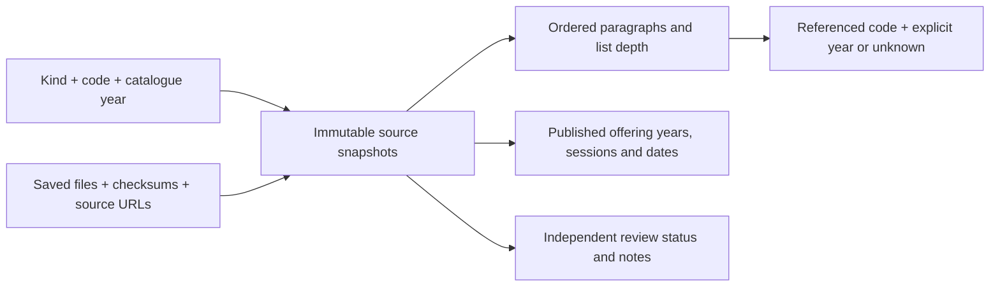

# Persistent catalogue evidence

Implemented at `/catalogue/`. This is the foundation for interpreting course
relationships, not an automatic degree planner. It is public and works without
sign-in or JavaScript.

The initial import contains 105 local HTML files: 76 course versions, three
programs and seven specialisations, all with 2027 catalogue metadata. Nineteen
duplicate copies share records while retaining their paths and file checksums.
There are 394 references in requirement/advice/outcome blocks and 154 offering
rows, including explicitly labelled 2028 offerings. References are mentions,
not 394 approved prerequisite or membership rules.

## Model

`src/lib/schema.ts` defines five additive SQLite tables:

| Table | Meaning |
| --- | --- |
| `catalogue_versions` | Identity by kind, code and catalogue year; titles never merge codes. |
| `catalogue_snapshots` | Content fingerprint and structured evidence JSON: source wording, paragraph order/list depth, offerings and extraction gaps. Different wording retains another snapshot. |
| `catalogue_sources` | Every saved copy's path, raw-file SHA-256 and original/canonical ANU URL. |
| `catalogue_references` | Indexed mentions tied to a snapshot, section, block and exact quote. A target may be missing or have an unspecified year. |
| `catalogue_reviews` | Review status and notes, independent of imports; initially unreviewed. No review editor or executable rule expression is implemented yet. |

Offering records live in each immutable snapshot's evidence JSON. They do not
create rows in the enrolment system's `offerings` table. The existing 2026
catalogue, fictional transcript, permission requests and enrolled selections
continue using their existing rules. The library is read from SQLite, rather
than reading browser downloads on each request.

Imports are additive. A changed same-code/year source is shown as another
version, with a warning and fresh review state. No variant is automatically
chosen as current; resolving or superseding a conflict is future work. The
dataset retains historical snapshots as well as the database. Removing a local
download is not an instruction to erase existing evidence.

## Reproduce or extend the import

1. Keep the supplied pages in `assets/Courses`, `assets/Degrees` and
   `assets/Specializations`. Directories ending `_files` are ignored. Do not
   rename duplicate downloads to pretend they are different courses.
2. Run `pnpm catalogue:import` using Node 24 and pnpm 11.9.0. On this Windows
   machine use the Docker workflow in `CLAUDE.md`, substituting that command for
   `pnpm check`. The parser has no fetch operation and JSDOM runs neither scripts
   nor external resources. Docker `--network none` can additionally isolate an
   import executed directly with `node scripts/import-catalogue.ts`.
3. Review the diff in `src/data/catalogue-sources.json`, especially additional
   same-code/year variants and extraction issues. Running the import twice on
   unchanged files produces the same JSON.
4. Run `pnpm check`, build and restart the app. Boot applies the generated
   migration and idempotently adds evidence to the existing SQLite database.
   It preserves review notes and student actions. Never modify the production
   database by hand.

The normalized JSON is version-controlled and bundled into the server. Fresh
checkouts and deployments work without the raw downloads. Raw assets stay in
the user's workspace and are excluded from Docker build uploads; they are not
served as HTML or copied into the production image. The local preview database
lives in its Docker `app-data` volume; ordinary local development uses
`DATABASE_PATH` or `.data/app.db`, and Fly uses its persistent volume.

## Boundaries for the next planning step

- COMP8880 and COMP8980, and COMP6434 and COMP8430, remain separate identities.
  Incompatibility is not an alias, replacement, or a reciprocal rule.
- Requirements retain AND/OR wording and source order. Unit choice groups,
  exclusions, topic-specific prerequisites and permission requirements still
  need reviewed interpretations. A course appearing in two specialisations does
  not imply that its units can count twice.
- Explicit no-current-offerings, unknown availability and published sessions
  remain distinct. Future offerings are indicative, not guarantees.
- A link's explicit year is retained. A bare course mention or unversioned link
  has an unknown target year and is not silently resolved to 2027. Missing source
  targets remain visible without broken local links.
- The missing 2027 pages from the earlier 66-course checklist are COMP6442,
  COMP6490, COMP8405, ENGN6627 and MATH6005. Other mentions, such as undergraduate
  prerequisites, also legitimately have no saved page in this collection.
- The first requested planning example is still **VCOMP, 2026 commencement**.
  We need its actual rules and relevant offering evidence before promising a
  semester-by-semester path. The 2027 AI/ML discrepancy is preserved in the
  published text and audit notes; it is not a transition policy.

## Recommended migration to a 2027 demo

On 26 September John questioned keeping the active demo on 2026 while the saved
catalogue is 2027. Recommendation: make 2027 the active enrolment and planning
example. The current runtime is still 2026; grouping the library as Degrees,
Specialisations and Courses does not change its rules or stored enrolments.

The academic record should remain explicitly fictional. Matching the demo's
rules and offerings to published 2027 evidence is separate from claiming access
to anyone's real ANU grades or academic history.

Inspection of the current code and saved sources found:

- All 17 courses with executable prerequisite checks have 2027 source pages.
  Fifteen requisite texts match after whitespace normalization. COMP8620's
  difference is paragraph/punctuation spacing; its topic-specific prerequisite
  clause still needs to remain visible when describing what the check covers.
- COMP6528's saved source lists incompatibilities with ENGN6528, COMP4528 and
  ENGN4528 that the current transcription/check omits. This is an implementation
  gap to resolve, not proof that ANU changed the rule between years.
- Sixty-six of the 70 current course codes have a saved 2027 page. Their coarse
  semester/session sets match the current seed. COMP6442, COMP6490, ENGN6539 and
  ENGN8501 have no corresponding saved 2027 page; do not invent their offerings.
  The imported catalogue also contains ten codes absent from the current seed.

The migration should bind active rules to their 2027 source snapshots, populate
actual 2027 offerings, centralise the active-year defaults, and give the
fictional profile a coherent study timeline. It must preserve existing 2026
requests, approvals and enrolments under their original year; approval for one
year cannot grant enrolment in another. Do not merely replace displayed 2026
labels, or automatically declare all 76 imported courses eligible.

After that alignment, encode one reviewed degree/specialisation requirement
group with its source snapshot and an explanation of its AND/OR/counting
semantics, then test it against a small fictional study plan. A 2027 example
can use the supplied VCOMP source; obtaining 2026 commencement rules is needed
only if we also retain that older cohort as a planning example.
