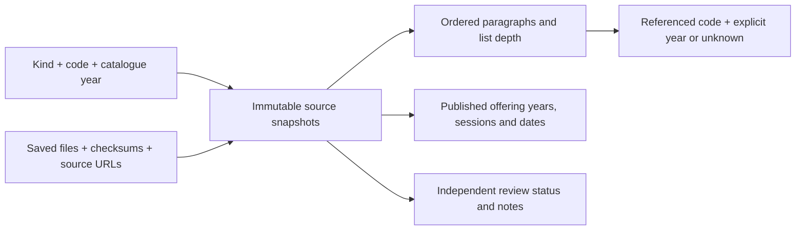

# Persistent catalogue evidence

Implemented at `/catalogue/`. This is the foundation for interpreting course
relationships, not an automatic degree planner. It is public and works without
sign-in or JavaScript.

The import after the 26 September follow-up contains 109 local HTML files: 80 course versions, three
programs and seven specialisations, all with 2027 catalogue metadata. Nineteen
duplicate copies share records while retaining their paths and file checksums.
There are 412 references in requirement/advice/outcome blocks and 164 offering
rows, including explicitly labelled 2028 offerings. References are mentions,
not 412 approved prerequisite or membership rules.

## Model

`src/lib/schema.ts` defines five additive SQLite tables:

| Table | Meaning |
| --- | --- |
| `catalogue_versions` | Identity by kind, code and catalogue year; titles never merge codes. |
| `catalogue_snapshots` | Content fingerprint and structured evidence JSON: source wording, paragraph order/list depth, offerings and extraction gaps. Different wording retains another snapshot. |
| `catalogue_sources` | Every saved copy's path, raw-file SHA-256 and original/canonical ANU URL. |
| `catalogue_references` | Indexed mentions tied to a snapshot, section, block and exact quote. A target may be missing or have an unspecified year. |
| `catalogue_reviews` | Review status and notes, independent of imports; initially unreviewed. No review editor or executable rule expression is implemented yet. |

Offering records live in each immutable snapshot's evidence JSON. At boot,
`seedPublishedOfferings` creates 2027 offering rows only for recognised sessions
with numeric class numbers in a single, unambiguous course snapshot. Search and
course details read the same SQLite evidence as the library. They show all 80
courses, including those without offerings, and preserve variable credit ranges.
Old offering rows remain for history; each new save, request and enrolment also
checks current source availability so retained rows cannot authorise stale offerings.

Imports are additive. A changed same-code/year source is shown as another
version, with a warning and fresh review state. No variant is automatically
chosen as current; resolving or superseding a conflict is future work. The
dataset retains historical snapshots as well as the database. Removing a local
download is not an instruction to erase existing evidence.

## Reproduce or extend the import

1. Keep the supplied pages in `assets/Courses`, `assets/Degrees` and
   `assets/Specializations`. Directories ending `_files` are ignored. Do not
   rename duplicate downloads to pretend they are different courses.
2. Run `pnpm catalogue:import` using Node 24 and pnpm 11.9.0. On this Windows
   machine use the Docker workflow in `CLAUDE.md`, substituting that command for
   `pnpm check`. The parser has no fetch operation and JSDOM runs neither scripts
   nor external resources. Docker `--network none` can additionally isolate an
   import executed directly with `node scripts/import-catalogue.ts`.
3. Review the diff in `src/data/catalogue-sources.json`, especially additional
   same-code/year variants and extraction issues. Running the import twice on
   unchanged files produces the same JSON.
4. Run `pnpm check`, build and restart the app. Boot applies the generated
   migration and idempotently adds evidence to the existing SQLite database.
   It preserves review notes and student actions. Never modify the production
   database by hand.

The normalized JSON is version-controlled and bundled into the server. Fresh
checkouts and deployments work without the raw downloads. Raw assets stay in
the user's workspace and are excluded from Docker build uploads; they are not
served as HTML or copied into the production image. The local preview database
lives in its Docker `app-data` volume; ordinary local development uses
`DATABASE_PATH` or `.data/app.db`, and Fly uses its persistent volume.

## Boundaries for the next planning step

- COMP8880 and COMP8980, and COMP6434 and COMP8430, remain separate identities.
  Incompatibility is not an alias, replacement, or a reciprocal rule.
- Requirements retain AND/OR wording and source order. Unit choice groups,
  exclusions, topic-specific prerequisites and permission requirements still
  need reviewed interpretations. A course appearing in two specialisations does
  not imply that its units can count twice.
- Explicit no-current-offerings, unknown availability and published sessions
  remain distinct. Future offerings are indicative, not guarantees.
- A link's explicit year is retained. A bare course mention or unversioned link
  has an unknown target year and is not silently resolved to 2027. Missing source
  targets remain visible without broken local links.
- The 26 September follow-up supplied COMP6442, COMP6490, ENGN6627 and MATH6005.
  The remaining COMP8405 reference is in CMSY-SPEC's explanatory advice, while
  its course-choice list explicitly names COMP8045. Keep the inconsistency
  unresolved; do not alias the codes or infer a replacement. Other mentions,
  such as undergraduate prerequisites, can remain references without full pages.
- The first requested planning example is still **VCOMP, 2026 commencement**.
  We need its actual rules and relevant offering evidence before promising a
  semester-by-semester path. The 2027 AI/ML discrepancy is preserved in the
  published text and audit notes; it is not a transition policy.

## Implemented 2027 enrolment alignment

On 26 September John questioned keeping the active demo on 2026 and then asked
to share entries with Find courses. The active enrolment example now uses 2027.
Degree and specialisation planning remains future work; a real student's
commencement-year rules are separate from the offering year.

The academic record should remain explicitly fictional. Matching the demo's
rules and offerings to published 2027 evidence is separate from claiming access
to anyone's real ANU grades or academic history.

Inspection of the current code and saved sources found:

- All 17 courses with executable prerequisite checks have 2027 source pages.
  Fifteen requisite texts match after whitespace normalization. COMP8620's
  difference is paragraph/punctuation spacing; its topic-specific prerequisite
  clause still needs to remain visible when describing what the check covers.
- COMP6528's saved source lists incompatibilities with ENGN6528, COMP4528 and
  ENGN4528 that the legacy transcription/check omits. The 2027 check now enforces
  them. This fixes an implementation gap, not a verified historical rule change.
- After the follow-up, 68 of the 70 current course codes have a saved 2027 page.
  Their coarse semester/session sets match the current seed. ENGN6539 and
  ENGN8501 have no corresponding saved 2027 page; do not invent their offerings.
  The imported catalogue also contains twelve codes absent from the current seed.

The initial `src/data/enrolment-rules-2027.json` bound 18 explicit prototype interpretations
to the inspected source hashes. Unmatched, changed or conflicting snapshots
receive no automatic check. Published wording is still shown for every course;
missing interpretation does not mean no prerequisites. COMP6320 and COMP8535
retain the existing prototype's grouping interpretation, not an assertion of
official ANU validation. COMP8620 checks base prerequisites and carries its
topic-specific review limit into both the student page and request timeline.

The eighteenth interpretation follows John's COMP7710 request finding. Its saved
2027 source (`26e64aa8e5553b48734121517dc2edf47a6de0b78f8faccb989bd6204403e046`,
requisite block 0) excludes both completion and current enrolment in COMP1110,
COMP1140 or COMP6710. `incompatible` retains completion semantics;
`incompatibleEnrolled` records the separate concurrent exclusions. Current
enrolments are scoped to the selected year and term in the fictional assessment.
No blanket permission requirement is added. A complete record with none of these
conflicts can enrol directly; missing record completeness remains unknown.
Historical request snapshots retain their original explanation even after this
interpretation is added. Reopening the course runs the current check.

Offered courses without an interpretation accept an assessment request.
The saved check remains unknown and retains its source reference; submission
does not itself establish eligibility or issue permission. Courses without a
usable offering remain browseable without an enrolment request. See
`eligibility-implementation-plan.md` for the request/decision flow.

`ACTIVE_YEAR` centralises new defaults. Legacy rules and course identities still
support explicitly year-scoped 2026 history. ENGN6539 and ENGN8501 are available
only in that history, not invented as 2027 entries. The generated migration
preserves IDs, requests, checks, decisions, events and enrolments; tests cover
upgrade and repeated boot. Old approvals cannot grant enrolment in 2027, or vice versa.
New fictional records place COMP6670 in 2026 S2. Existing registered records and
accounts are untouched. Seed example enrolments retain 2026 rather than moving
them to a new year without a student's action.

The populated upgrade test caught SQLite rejecting the generated table rebuild
when requests already had child events. `migrateDatabase` now sets foreign-key
enforcement before Drizzle's transaction, checks all references afterwards, and
restores enforcement before serving requests, following SQLite's
[table-rebuild procedure](https://www.sqlite.org/lang_altertable.html#otheralter).
The generated migrations themselves are unchanged. Tests cover rollback on
migration failure and restored enforcement as well as preserved user data.

After that alignment, encode one reviewed degree/specialisation requirement
group with its source snapshot and an explanation of its AND/OR/counting
semantics, then test it against a small fictional study plan. A 2027 example
can use the supplied VCOMP source; obtaining 2026 commencement rules is needed
only if we also retain that older cohort as a planning example.

## Full course-rule coverage after the follow-up

John asked to propagate the checks across all courses. The source-bound JSON now
accounts for all 80 course versions, with an interpretation note beside each tree:

| Coverage | Courses | Meaning |
| --- | ---: | --- |
| `encoded` | 62 | The saved requisite clauses are expressible by the evaluator. A record may still be incomplete or fail. |
| `partial` | 16 | The tree includes a specific unknown condition or an unresolved grouping. Known alternatives may still settle an individual case. |
| `missing-source` | 2 | MGMT7020 and REGN8014 have no requisite section. They produce an explicit unknown, never an empty successful checklist. |

This is prototype interpretation coverage, not official ANU validation. The two
source gaps are bound to their saved page hashes with empty source-block lists.
Changed, conflicting and wrong-year sources still invalidate an interpretation.
Raw downloaded pages and duplicate provenance are preserved; no ANU crawling or
database rewrite was used. The rules are bundled with the application and each
request persists its complete rule, record and policy snapshots in SQLite.

The evaluator now supports explicit six-unit choice lists, unique course counts,
program exclusions, an explicit postgraduate-career fact, and conditional
permission. Existing program keys retain their meaning. Other programs use their
published codes when supplied, or exact names when no code was given; similar
program names are not aliases. Corequisites use the selected year and term.
Duplicate transcript entries count a course once; if possible repeat credit is
needed to cross a threshold, the result asks for confirmation instead of inventing
extra credit. No equivalence is inferred from matching titles or adjacent numbers.

COMP8712's prior COMP3710/COMP6470 completion triggers permission, not exclusion.
COMP8430's intensive-mode condition remains unknown because the offering data does
not establish intensive mode. Neither course currently has a usable saved offering;
encoding its rules does not open enrolment. COMP6490/8490, COMP8800 and COMP8980
retain alternative AND/OR readings. The evaluator returns met or unmet only when
the readings agree; otherwise it exposes the ambiguity and next action. Individual
conditions can be expanded in the checklist. Earlier accepted COMP6320/8535 grouping
interpretations remain labelled prototype choices as documented above.

Topic announcements for COMP8011/8020/8045/8620/8650, COMP8536 equivalence,
COMP8715 group/project approval, COMP8800 GPA and project registration,
COMP8830 competitive selection, and LAWS8445 case-by-case acceptance remain
explicit evidence requirements. MATH6213's exact-mark/equivalence/suitability
advice is not converted from “should” into a hard rejection threshold. MATH6005's
restriction is scoped to CECS students; a program name alone does not establish
college applicability for other profiles.

`demo-permission-v2` supports the conditional permission result. It does not read
or obey student prose. Previously saved v1 reports and staff approvals remain
unchanged. Ordinary permission-only courses such as COMP8820 can now demonstrate
assessment, demo permission and explicitly confirmed profile enrolment without
the separate COMP8620 scenario. This is still a demo policy, not university authority.

`spec/catalogue-rule-coverage.test.ts` checks all source identities and explicit
course mentions, 91 source-authored record examples, and the new operators and
evidence boundaries. `spec/expanded-course-flow.test.ts` covers corequisite scope,
new profile permission, confirmation, historical-report preservation and unavailable
offerings through HTTP. The original three reference cases remain a small seed
for the future Llama benchmark; these tests are not a claim of model accuracy.
