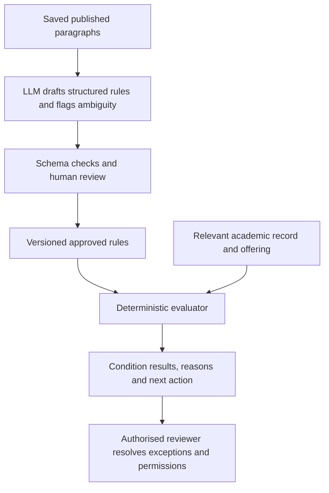

# Structured eligibility and assisted rule extraction

Assessment requested on 26 September 2026. This is a proposal for discussion,
not an implemented LLM integration or a change to the running gate.

## Feasibility and existing foundation

Course eligibility is feasible to compute from structured rules and structured
academic records. The main uncertainty is interpreting the source correctly and
obtaining the relevant facts, rather than evaluating a Boolean expression.

The current implementation already has:

- A requirement tree (`all`, `any`, course completion/current enrolment,
  program membership and minimum passed units) in `src/data/requisites.ts`.
- Seventeen 2027 rule interpretations, each bound to a course and source hash,
  in `src/data/enrolment-rules-2027.json`.
- A pure evaluator in `src/lib/eligibility.ts`, supplied with program, passed
  courses and units, failed attempts and scoped current enrolments.
- Persistent source snapshots, source paragraphs, fictional profiles, offering
  identities, applications and decision events.

For example, COMP6242 requires one completion from its ML group AND one from
its programming group. The newly generated fictional profile includes COMP6670
and COMP6710, which satisfy those two groups. That is already a computation.
It does not establish degree progress, seats, timetable fit or official admission.

## What the saved sources require us to represent

| Saved 2027 example | Computable conditions | Evidence or judgement still needed |
| --- | --- | --- |
| COMP6242 | AND of two OR groups of passed courses | A sufficiently complete record |
| COMP8535 | Program membership and passed COMP6 units | Confirm the scope of the published AND/OR grouping; the current prototype has an explicit interpretation |
| COMP8430 | Prerequisites and incompatibility; permission for intensive mode | Whether the selected class is actually intensive; do not infer it from a short session name |
| COMP8620 | Base prerequisite group, incompatibility, permission required | Additional prerequisites for the announced topic, followed by a reviewer decision |
| COMP8800 | Program, completion/concurrent study, unit total, GPA threshold | Defined GPA evidence and calculation policy, project registration and permission |
| COMP8830 | Program, course groups, incompatibilities, permission required | Competitive selection; passing prerequisites does not secure a place |
| MATH6213 | A mark threshold against an accepted equivalent course | Exact mark, confirmed equivalence and the published consultation route |
| MGMT7020 / REGN8014 | No complete check from this collection | Missing requisite section; absence is not evidence of no requirements |

These observations come from the supplied HTML's stored evidence. No ANU course
pages were crawled. Missing undergraduate course pages need not prevent matching
a prerequisite code to a transcript. Equivalence still requires its own evidence;
a shared title or similar code is insufficient.

## Proposed decision model

Extend each requirement result to `met`, `unmet` or `unknown`, with an explanation
and supporting record/source references. AND is unmet if any child is unmet,
otherwise unknown if a child is unknown. OR is met if any child is met,
otherwise unknown if a child is unknown. A known failure may coexist with
unresolved conditions in the detailed report. Missing data must never count as
successful completion or silently disappear from the evaluated rule.

Keep these separate in the result:

1. Academic prerequisite and incompatibility checks.
2. Published permission policy: required, conditionally required, not required
   under the reviewed policy, or unknown.
3. Evidence of a permission decision for this student, course, year and term.
4. Offering availability and external/administrative conditions.

For COMP8620, a report can therefore say: base prerequisites met; permission
required; topic prerequisites awaiting review. An unmet condition does not
automatically establish that a waiver exists or that a request must be rejected.
The current prototype's automatic rejection policy is a separate policy choice,
not something to infer from an LLM's reading of a prerequisite sentence.

Persist reviewed rule versions with course/catalogue year, relevant offering
conditions, exact source hash and paragraph references, interpretation status,
reviewer and time. Keep candidate rules separate from active versions. Preserve
the original paragraph alongside the rule. Each evaluation should retain the
rule version and relevant academic-record snapshot so it remains explainable
after a catalogue or profile update.

Profiles would need optional exact marks, result dates, attempts, credit and
accepted equivalences, plus explicit completeness/provenance. Program/cohort
rules remain separate from offering years. The current pass-code/unit view
cannot settle every GPA, mark or equivalence rule. Use a deliberately fictional
fixture when demonstrating such data; do not invent it for an existing account.

## Proposed role for a small language model

The model can assist with parsing prose into a constrained rule vocabulary and
pointing to the source of each condition. It should identify unsupported clauses
and unclear grouping instead of completing them by guesswork. The final outcome
comes from the reviewed rules and an authorised reviewer where required.
Extraction needs the public requirement paragraphs; it does not need a student's
email, password or transcript.

The [Ollama structured-output interface](https://docs.ollama.com/capabilities/structured-outputs)
accepts a JSON schema. This makes constrained extraction practical, but valid
JSON does not prove the intended rule was captured. Validate operators, code/year
identity, source references, nonempty groups, completeness and unresolved clauses.
Never execute generated JavaScript or SQL as a course rule. A model's own
confidence score must not promote a draft into an active rule.

[Qwen3-4B-Instruct-2507](https://huggingface.co/Qwen/Qwen3-4B-Instruct-2507)
is one Apache-2.0, four-billion-parameter candidate for a bounded local trial.
No model has been downloaded, benchmarked or selected for production here.
The current `fly.toml` specifies 256 MB RAM, unsuitable for hosting this model.
Run extraction locally during catalogue maintenance, then deploy the reviewed
rules with the existing web app. A later online assistant could use separate
inference infrastructure if a demonstrated product need justifies it. No training
from scratch or fine-tuning is needed to begin this extraction experiment.

## Recommended bounded next increment

1. Extend the rule vocabulary and unknown-result handling; add source-linked
   explanations. Build a small reviewed reference set covering the difficult
   cases above, not just straightforward prerequisite lists.
2. Add an authoring/review workflow that persists candidate rules, unresolved
   clauses and approved versions. This is useful even with manual entry alone.
3. Trial a small model against the reference set. Keep examples used for prompt
   tuning separate from held-out checks. Assess grouping, omitted conditions,
   invented requirements, unknown handling and resulting student decisions.
   Existing 17 checks are regression examples, not an official gold standard.
4. Measure review effort and local latency/memory before choosing a model or
   hosting arrangement. Initially every extracted rule needs human approval;
   any observed unsupported direct-enrolment outcome blocks promotion of that
   candidate. Passing a finite test set is not a guarantee about all future text.

This stays within the published Crit 7 enrolment slice. Multi-semester scheduling,
specialisation counting and avoiding double-counted credit are a further
constraint-planning problem. Structured eligibility is a useful foundation for
that work, but this proposal does not implement or validate a complete study planner.
